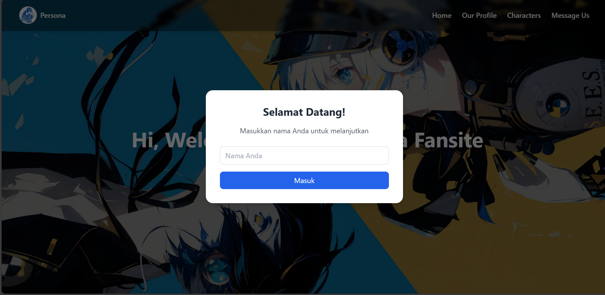
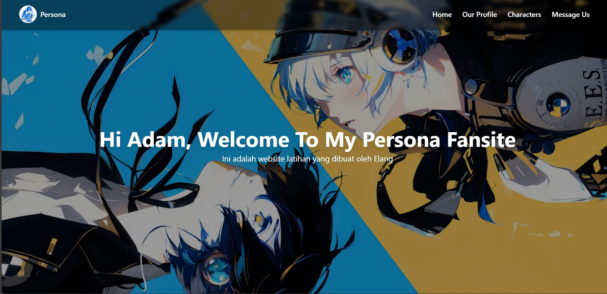
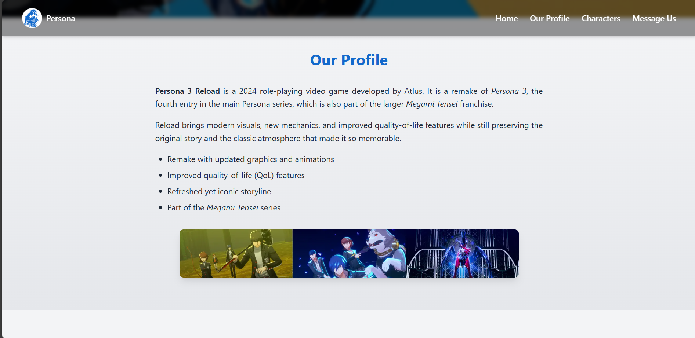
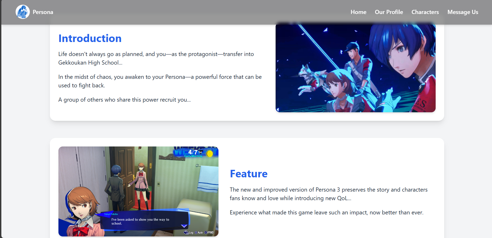
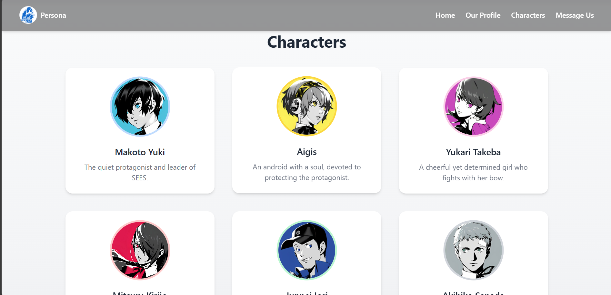
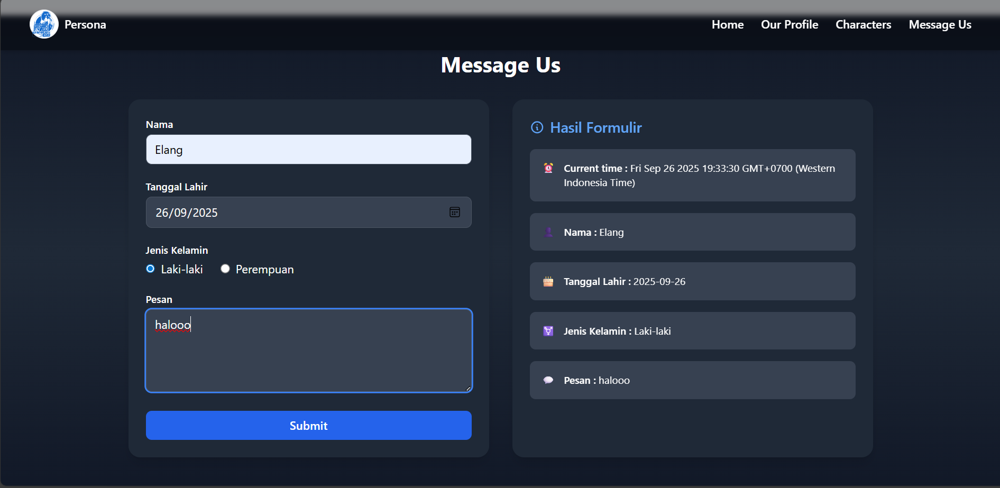

# 🌐 Persona Fansite Website

Website sederhana bertema **Persona Fansite** yang dibuat sebagai latihan penggunaan **HTML**, **Tailwind CSS**, dan **JavaScript**.  
Project ini menampilkan beberapa section seperti **Hero**, **Profile**, **Characters**, dan **Message Us**, lengkap dengan **formulir input-output** serta **modal input nama** saat pertama kali membuka website.

---

## 🚀 Fitur Utama

- **Hero Section**  
  Menampilkan sapaan personal berdasarkan nama yang diinputkan melalui modal.

- **Navbar Responsive**  
  - Navigasi dengan efek hover.  
  - **Hamburger menu** otomatis aktif pada perangkat mobile.

- **Profile & About Section**  
  Menjelaskan detail mengenai *Persona 3 Reload* dengan teks, list, dan gambar.

- **Characters Section**  
  Galeri karakter dengan desain grid responsif, efek hover, dan highlight warna.

- **Message Us Form**  
  Form interaktif dengan input:
  - Nama
  - Tanggal Lahir
  - Jenis Kelamin
  - Pesan  
  Output ditampilkan secara **real-time** di samping form dengan desain kartu.

- **Modal Input Nama**  
  Saat website dibuka pertama kali, akan muncul modal untuk memasukkan nama.  
  Nama tersebut ditampilkan pada hero section dengan teks **"Hi {nama}, Welcome To..."**.

- **Footer**  
  Footer sederhana berisi credit pembuat.

---

## 🛠️ Teknologi yang Digunakan

- **HTML5** → struktur halaman
- **Tailwind CSS** → styling modern & responsive
- **JavaScript (Vanilla)** → interaktivitas (form output, modal, menu, dsb.)

---

## 📂 Struktur Project

```bash
.
├── assets/             # Folder gambar karakter & ilustrasi
├── css/
│   └── style.css       # File CSS tambahan (selain Tailwind)
├── js/
│   └── script.js       # File JavaScript untuk interaktivitas
├── index.html          # File utama website
└── README.md           # Dokumentasi project

```

---

## 📷 Screenshot Halaman











